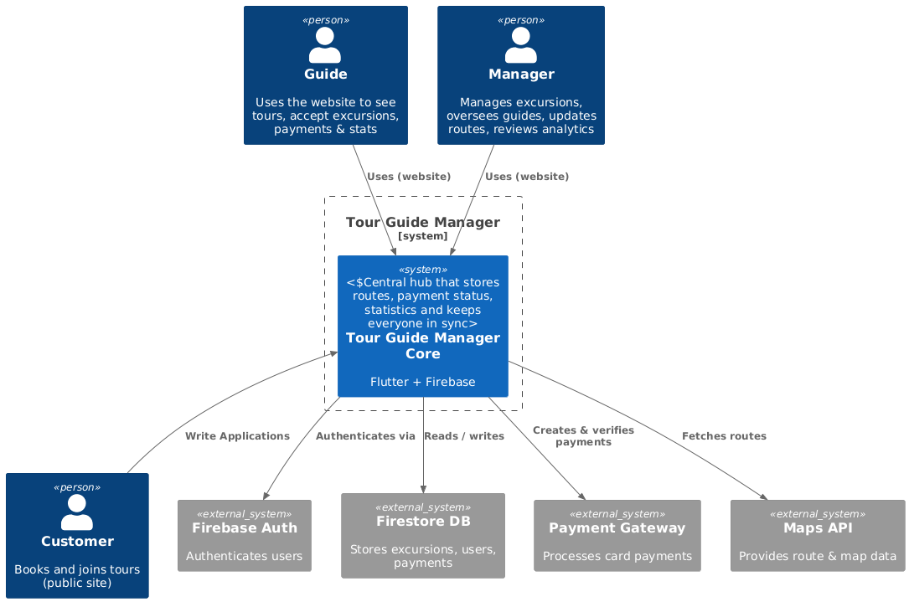

# TourGuide Manager 🚀

A software development project for Innopolis University.  
This repository contains the source code and documentation for our MVP releases.

## 📍 Live Demo  
[👉 Deployed Version]
- (https://tourapp-66e02.web.app/)
- (https://tourappmanager.ru/)
  
[🎥 Watch Demo Video (2 mins)](https://your-demo-video-link.com)

---

## 📌 Table of Contents
- [About the Project](#about-the-project)
- [Project Context](#project-context)
- [Feature Roadmap](#feature-roadmap)
- [Usage Guide](#usage-guide)
- [Installation & Deployment](#installation--deployment)
- [Documentation](#documentation)
- [Changelog](#changelog)
- [License](#license)

---

## 🧠 About the Project

This project aims to centralize and streamline tour-guide management by providing a single, always-up-to-date hub for routes, payment status, statistics, participant lists, and direct manager communication—eliminating the need for scattered Telegram notifications.  
Our goals are:
- ✅ Deliver a user-friendly MVP
- ✅ Gather feedback via customer testing
- ✅ Improve usability and performance iteratively

It is built using technologies such as **Flutter**, **Firebase**, and **GitHub Actions** for CI/CD.

---

## 👥 Project Context

Stakeholders:
- Customer: _Karina Shavalieva (@K_Arbyzova)_, _Hannanov Rishat (@RishatHannanov)_
- Developers:

| Participant      | Role            | GitHub Link                       |
|---------------|-----------------|----------------------------------------|
| Aleksey Chegaev   | Team Lead, Configure Database    | [github.com/wyroxx](https://github.com/wyroxx) |
| Aleksandr Medvedev | Flutter Developer     | [github.com/BearAx](https://github.com/BearAx) |
| Nikita Shankin    | Flutter Developer     | [github.com/Mysteri0K1ng](https://github.com/Mysteri0K1ng) |
| Georgii Beliaev | Web-Developer    | [github.com/JoraXD](https://github.com/JoraXD) |
| Alexander Simonov    | Web-Developer   | [github.com/AlexbittIT](https://github.com/AlexbittIT) |


External Systems:
- Firebase Authentication
- Firestore Database
- Telegram Bot API (if used)

📌 Context Diagram:  


---

## ✅ Feature Roadmap

| Feature                                | Status       |
|----------------------------------------|--------------|
| User Login / Auth                      | ✅ Implemented |
| Excursion Listing                      | ✅ Implemented |
| Profile Management                     | ✅ Implemented |
| Calendar Integration                   | ✅ Implemented |
| Subscription Flow                      | ✅ Implemented |
| Customer Feedback & Testing            | ⏳ In Progress |
| Admin Analytics Dashboard              | ⬜ Planned |

---

## 🧾 Usage Guide

1. Visit the [deployed app](https://your-deployment-link.com)
2. Log in with your credentials
3. Use the calendar to browse excursions
4. Open Profile to view your plan
5. If you see an empty task screen, upgrade your plan

Even users who say _“I just copy and paste without reading”_ will find the interface intuitive and straightforward.

---

## 🛠 Installation & Deployment

### Prerequisites
- Flutter SDK
- Firebase CLI
- Dart >=3.0.0

### Steps

```bash
git clone https://github.com/ProjectSWD12/SWD_Project.git
cd SWD_Project
flutter pub get
