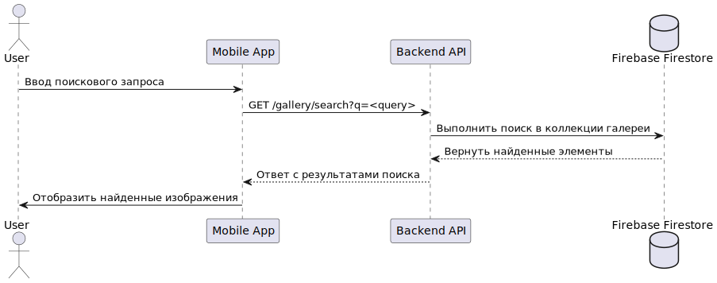
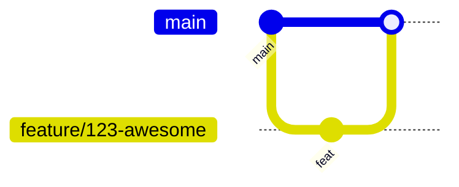

# README

---

## Usage

**MVP v2**. 
- website for guides: https://tourapp-66e02.web.app/
- website for admins: https://tourappmanager.ru/

---

## Architecture

> Diagrams are stored in `docs/architecture/`. Any format is acceptable (PlantUML, Mermaid, Draw.io). Link to the files or embed images.

### Static view

<Brief explanation of how the chosen modular structure reduces coupling and improves maintainability.>

### Dynamic view

<Describe the scenario, measured response time (ms) and bottlenecks.>

### Deployment view

<Comment on customer installation, infrastructure and required permissions.>

---

## Development

### Kanban board

- **Link:** <https://gitlab.com/example/project/-/boards>
- **Entry criteria:**
  | Column | Entry criteria |
  |--------|----------------|
  | **Backlog** | Issue created, priority set |
  | **Ready**   | Estimated (Story Points), acceptance criteria defined |
  | **In Progress** | MR created, assignee set |
  | **Review** | CI ✅, PR checklist passed |
  | **Done** | MR merged into `main`, issue closed |

### Git workflow

- **Base flow:** GitHub Flow  <!-- or Gitflow -->
- **Branch naming:** `feature/<issue-id>-<slug>` | `bugfix/<issue-id>-<slug>`
- **Commit message style:** Conventional Commits, e.g. `feat(auth): add JWT refresh`.
- **Pull request template:** `.github/PULL_REQUEST_TEMPLATE.md` (link).

### Secrets management

<Describe where you store secrets (Vault, GitLab CI Variables, Ansible Vault, etc.) and how they reach the app.>

---

## Quality assurance

### Quality attribute scenarios

Document: [docs/quality-assurance/quality-attribute-scenarios.md](docs/quality-assurance/quality-attribute-scenarios.md)

### Automated tests

| Type | Framework | Path |
|------|-----------|------|
| Unit | pytest | `tests/unit/` |
| Integration | pytest + Docker | `tests/integration/` |
| Static analysis | flake8, mypy, bandit | `.github/workflows/ci.yml` |

### User acceptance tests

Document: [docs/quality-assurance/user-acceptance-tests.md](docs/quality-assurance/user-acceptance-tests.md)

---

## Build and deployment

### Continuous Integration

- **Workflow files:**
  - `.github/workflows/ci.yml` — linting, unit + integration tests, coverage.
  - `.github/workflows/release.yml` — tag, artifact build.
- **CI Dashboard:** <https://github.com/example/project/actions>
- **Static analysers:** flake8, mypy, bandit — catch defects early.

### Continuous Deployment (optional)

- **File:** `.github/workflows/cd.yml` — deploys to staging and production.
- **Logs:** <https://github.com/example/project/actions/workflows/cd.yml>

---

<!-- End of template -->
